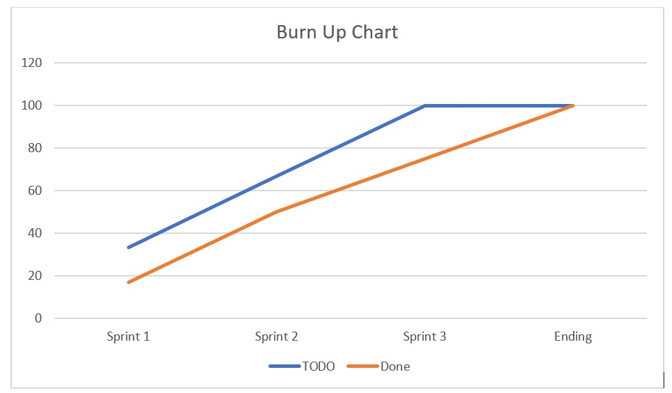
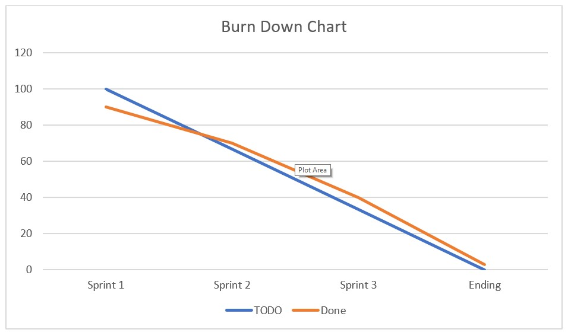

# Sprint Planning #1
Date/Time: 10/12/23
Participants: Jaylon, Aaron, Ricardo, Seth, Ben
Goal Statement: To Get US1 and US2 working

# Daily Scrums
# 10/14/23-4:30pm
Participants: Jaylon, Aaron, Ricardo, Seth, Ben
Name: Jaylon
What did you do yesterday?: setting up square api
What are you doing today?: To get the html looking like a form to the signup form
Are there any obstacles in your path?: Understanding what tht might look like

Name: Ben
What did you do yesterday?: setting up square api
What are you doing today?: Getting the routes to connect the to the html for signup
Are there any obstacles in your path?: Time management

Name: Seth
What did you do yesterday?: setting up square api
What are you doing today?: Getting the buttons in the home index html
Are there any obstacles in your path?: Nothing so far

Name: Ricardo
What did you do yesterday?: setting up square api
What are you doing today?: Gettin the signin html to work
Are there any obstacles in your path?: Code might not work a lot

Name: Aaron
What did you do yesterday?: setting up square api
What are you doing today?: Getting the routes to connect to the signin
Are there any obstacles in your path?: Nothing so far

# 10/17/23-6:30pm
Participants: Jaylon, Aaron, Ricardo, Seth, Ben
Name: Jaylon
What did you do yesterday?: To get the html looking like a form to the signup form
What are you doing today?: To get the html looking like a form to the signup form
Are there any obstacles in your path?: Understanding what tht might look like

Name: Ben
What did you do yesterday?: Getting the routes to connect the to the html for signup
What are you doing today?: Getting the routes to connect the to the html for signup
Are there any obstacles in your path?: Time management

Name: Seth
What did you do yesterday?: Getting the buttons in the home index html
What are you doing today?: Getting the buttons in the home index html
Are there any obstacles in your path?: Constant errors

Name: Ricardo
What did you do yesterday?: Gettin the signin html to work
What are you doing today?: Gettin the signin html to work
Are there any obstacles in your path?: Code might not work a lot

Name: Aaron
What did you do yesterday?: Getting the routes to connect to the signin
What are you doing today?: Getting the routes to connect to the signin
Are there any obstacles in your path?: Errors

## 10/18/23-4:00pm
Participants: Jaylon, Aaron, Ricardo, Seth, Ben
Name: Jaylon
What did you do yesterday?: To get the html looking like a form to the signup form
What are you doing today?: To get the US2 ID num to work
Are there any obstacles in your path?: Time

Name: Ben
What did you do yesterday?: Getting the routes to connect the to the html for signup
What are you doing today?: To get the US2 ID num to work
Are there any obstacles in your path?: Time

Name: Seth
What did you do yesterday?: Getting the buttons in the home index html
What are you doing today?: To get the US2 ID num to work
Are there any obstacles in your path?: Code might not work

Name: Ricardo
What did you do yesterday?: Gettin the signin html to work
What are you doing today?: To get the US2 ID num to work
Are there any obstacles in your path?: Code might not work a lot

Name: Aaron
What did you do yesterday?: Getting the routes to connect to the signin
What are you doing today?: To get the US2 ID num to work
Are there any obstacles in your path?: Errors might slow me down
# Sprint Review
Date/Time: 10/19/23 2:00pm
Participants: Aaron, Ricardo, Seth, Ben
Notes: Do better in Jira and continue to take notes and use templates to continue working on this project.

# Sprint Retrospective
Date/Time: 10/20/23 4:00pm
Participants: Jaylon, Aaron, Ricardo, Seth, Ben
Notes: To work in this template, and do better with jira and take more notes in each sprint and taking notes in our daily scrum.
----------------------------------------------------------------------------------------------------------------------------------------------
# Sprint Planning #2
Date/Time: 10/19/23
Participants: Jaylon, Aaron, Ricardo, Seth, Ben
Goal Statement: To Get US2 and US3 working and somewhat of US4 and if possible US5

# Daily Scrums
## 10/22/23-12:00pm
Participants: Jaylon, Aaron, Ricardo, Seth, Ben
Name: Jaylon
What did you do yesterday?: To get the html looking like a form to the signup form
What are you doing today?: To create an HTML for the users Id for orders
Are there any obstacles in your path?: Errors keeping me from finishing on time

Name: Ben
What did you do yesterday?: Getting the routes to connect the to the html for signup
What are you doing today?: To build an HTML for the orders in the list in 
Are there any obstacles in your path?: Code might not work

Name: Seth
What did you do yesterday?: To get the US2 ID num to work
What are you doing today?: To help with US2 to get ID from square
Are there any obstacles in your path?: Code not working

Name: Ricardo
What did you do yesterday?: To get the US2 ID num to work
What are you doing today?: To help with US2 to get ID from square
Are there any obstacles in your path?: Being able to get the code to work

Name: Aaron
What did you do yesterday?: To get the US2 ID num to work
What are you doing today?: To help with US2 to get ID from square
Are there any obstacles in your path?: Nothing so far

## 10/23/23-4:00pm
Participants: Jaylon, Aaron, Ricardo, Seth, Ben
Name: Jaylon
What did you do yesterday?: To get the html looking like a form to the signup form
What are you doing today?: Create html template to show in order
Are there any obstacles in your path?: 

Name: Ben
What did you do yesterday?: Getting the routes to connect the to the html for signup
What are you doing today?: To work on when user is clicking on order fetches order information
Are there any obstacles in your path?: Constant errors that will keep me from finishing

Name: Seth
What did you do yesterday?: To get the US2 ID num to work
What are you doing today?: to make sure all information for each item is shown in table
Are there any obstacles in your path?: Errors and time

Name: Ricardo
What did you do yesterday?: To get the US2 ID num to work
What are you doing today?: To check if it throws an error if queried order does not exist
Are there any obstacles in your path?: Nothing so far

Name: Aaron
What did you do yesterday?: To get the US2 ID num to work
What are you doing today?: Working on check if order is already in cache and query Square if it is not 
Are there any obstacles in your path?: Code might not work keeping me from finishing

## 10/24/23-6:00pm
Participants: Jaylon, Aaron, Ricardo, Seth, Ben
Name: Jaylon
What did you do yesterday?: Create html template to show in order
What are you doing today?: Create html template to show in order
Are there any obstacles in your path?: 

Name: Ben
What did you do yesterday?: To work on when user is clicking on order fetches order information
What are you doing today?: To work on when user is clicking on order fetches order information
Are there any obstacles in your path?: Constant errors that will keep me from finishing

Name: Seth
What did you do yesterday?:to make sure all information for each item is shown in table
What are you doing today?: to make sure all information for each item is shown in table
Are there any obstacles in your path?: Errors and time

Name: Ricardo
What did you do yesterday?: To check if it throws an error if queried order does not exist
What are you doing today?: To check if it throws an error if queried order does not exist
Are there any obstacles in your path?: Nothing so far

Name: Aaron
What did you do yesterday?: Working on check if order is already in cache and query Square if it is not 
What are you doing today?: Working on check if order is already in cache and query Square if it is not 
Are there any obstacles in your path?: Code might not work keeping me from finishing

# Sprint Review
Date/Time: 10/26/23 1:40 PM
Participants: Jaylon, Aaron, Ricardo, Seth, Ben
Notes: We did great showing Mr T our working code and he knows we officailly got US2 and US3 working.

# Sprint Retrospective
Date/Time: 10/27/23 4:00PM
Participants: Jaylon, Aaron, Ricardo, Seth, Ben
Notes: We need to better prepare showing Mr T our code and making sure we don't keep him waiting too long. But other than that we did very good with this sprint.
--------------------------------------------------------------------------------------------------------------------------------------------
# Sprint Planning #3
Date/Time: 10/26/23
Participants: Jaylon, Aaron, Ricardo, Seth, Ben
Goal Statement: To finishing up US4 and get US5 and US6 working and getting cache to work properly to test each one of the user stories.

# Daily Scrums
## 10/27/23-12:00pm
Participants: Jaylon, Aaron, Ricardo, Seth, Ben
Name: Jaylon
What did you do yesterday?:Create html template to show in order
What are you doing today?: To Add button on user homepage to view expenses which redirects to new HTML page
Are there any obstacles in your path?: Nothing so far.

Name: Ben
What did you do yesterday?: To work on when user is clicking on order fetches order information
What are you doing today?: To calculate monthly expenses from the logged-in user
Are there any obstacles in your path?: Code might not working

Name: Seth
What did you do yesterday?: To make sure all information for each item is shown in table
What are you doing today?: Displaying the result of the calculaions in table
Are there any obstacles in your path?: The table might look ugly

Name: Ricardo
What did you do yesterday?: To check if it throws an error if queried order does not exist
What are you doing today?: To Set up HTML for showing expenses (table&/or graph)
Are there any obstacles in your path?: Code preventing mr from finishing on time

Name: Aaron
What did you do yesterday?: Working on check if order is already in cache and query Square if it is not 
What are you doing today?: Test to make sure the user can everything perfectly and it won't look crazy.
Are there any obstacles in your path?: Waiting for my team to finish on time.
## 10/28/23-3:30pm
Participants: Jaylon, Aaron, Ricardo, Seth, Ben
Name: Jaylon
What did you do yesterday?: To Add button on user homepage to view expenses which redirects to new HTML page
What are you doing today?: Make a HTML tamplate with tables
Are there any obstacles in your path?: Code might not work

Name: Ben
What did you do yesterday?: To calculate monthly expenses from the logged-in user
What are you doing today?: Create route returning list of most ordred items
Are there any obstacles in your path?: Code errors might keep me from finishing on time

Name: Seth
What did you do yesterday?: Displaying the result of the calculaions in table
What are you doing today?: To make order items by purchase amount
Are there any obstacles in your path?: Code might not work

Name: Ricardo
What did you do yesterday?: To Set up HTML for showing expenses (table&/or graph)
What are you doing today?: Limit the top 5 most pushased items
Are there any obstacles in your path?: Code might not work on time

Name: Aaron
What did you do yesterday?: Test to make sure the user can everything perfectly and it won't look crazy.
What are you doing today?: Optimize cache usage
Are there any obstacles in your path?: Code might not work correctly
## 10/30/23-1:00pm
Participants: Jaylon, Aaron, Ricardo, Seth, Ben
Name: Jaylon
What did you do yesterday?: To Add button on user homepage to view expenses which redirects to new HTML page
What are you doing today?: Working on Jira
Are there any obstacles in your path?: Time

Name: Ben
What did you do yesterday?: To calculate monthly expenses from the logged-in user
What are you doing today?: To create HTML template with table and create route to return list of most expensive items
Are there any obstacles in your path?: Code might not work on time

Name: Seth
What did you do yesterday?: To make order items by purchase amount
What are you doing today?: To create an order items by price and limit that graph to top 5.
Are there any obstacles in your path?: Time

Name: Ricardo
What did you do yesterday?: Limit the top 5 most pushased items
What are you doing today?: Working on templates for thrusday meeting
Are there any obstacles in your path?: Time

Name: Aaron
What did you do yesterday?: Optimize cache usage
What are you doing today?: Optimize cache to test our code.
Are there any obstacles in your path?: Might not finish on time

# Sprint Review
Date/Time: 11/2/23 1:30pm
Participants: Aaron, Ricardo, Seth, Ben
Notes: We did amazing meeting with Mr T. We shown our progress and he so far loved it. But we think we should have made eveything work together onto one computer so he did not have to look between two different computers

# Sprint Retrospective
Date/Time: 11/3/23 1:00pm
Participants: Jaylon, Aaron, Ricardo, Seth, Ben
Notes: For ur next project sprints we will code on our own branch so we will not get too many merge conflicts. We have been working together with a few branches but sometimes when someone works on the same branch we often have merge conflicts. We will work better on our templates and jira now since we know exactly how ths should be.

# Burn up Chart

# Burn Down Chart

